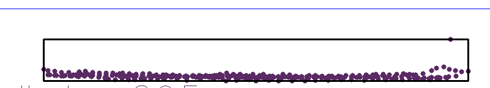
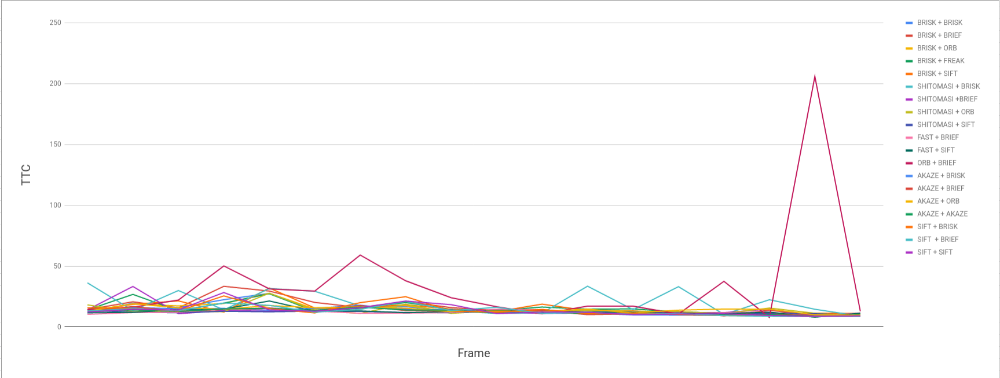
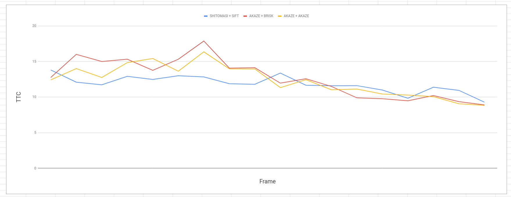

# SFND 3D Object Tracking

# FP.1 Match 3D Objects
This was implemented in the function matchBoundingBoxes in camFusion_Student.cpp.
The algorithm used is very simple. For each box in the previous count the ammount of common keypoints with all the bokes in the current frame. The one with the most correspondeces is the best match.

# FP.2 Compute Lidar-based TTC
This was implemented in the function computeTTCLidar in camFusion_Student.cpp.
To handle outliers we take the average of the points in x direction and use that as the distance to compute ttc.

# FP.3 Associate Keypoint Correspondences with Bounding Boxes
This was implemented in the function clusterKptMatchesWithROI in camFusion_Student.cpp.
To solve this we loop through all points and keep only those inside the bouding box. We also compute the mean distance and exclude all above 1.2 times the mean.

# FP.4 Compute Camera-based TTC 
This was implemented in the function computeTTCCamera in camFusion_Student.
To solve this we use clusterKptMatchesWithROI implemented in the last task and use the method described earlier in the class (using ratio of kp distance).

# FP.5 Performance Evaluation 1
In the image bellow we can clearly see the problem with some lidar samples. Since we take the mean in the x direction outliers like this shift thean causing us to underestimate/overestimate the ttc. We can mitigate this implementing other kind of outlier mitigation or by increacing the percentage of the bounding box that is ignored. In the example bellow we can clearly see that our system will estimate a distance of aprox 8.2 meter when its closer 7.5. Thus our ttc will be of by aprox a second (based on calculated velocity with the frame rate and lidar)

# FP.6 Performance Evaluation 2
In order to evaluate detector and descriptor accuracy i logged the ttc for every frame for each combination. Then i removed the ones with impossible values.

We can see some combinations that yield bad results. So i removed the ouliers, and the ones whose ttc fluctuates a lot (because the velocity is assumed contant and the car is aproximating). The best combinations are displayed bellow. Those are what i recomend. SHITOMASI+SIFT is the fastest of the displayed bellow so based on my results that's the best one.

